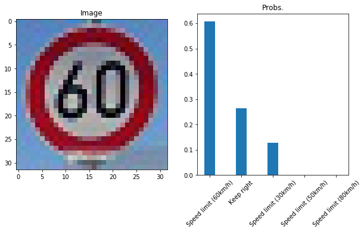

# Traffic Sign Recognition

**Build a Traffic Sign Recognition Project**

The goals / steps of this project are the following:
* Load the data set (see below for links to the project data set)
* Explore, summarize and visualize the data set
* Design, train and test a model architecture
* Use the model to make predictions on new images
* Analyze the softmax probabilities of the new images
* Summarize the results with a written report


[//]: # (Image References)

[image1]: ./examples/visualization.jpg "Visualization"
[image2]: ./examples/grayscale.jpg "Grayscaling"
[image3]: ./examples/random_noise.jpg "Random Noise"
[image4]: ./examples/placeholder.png "Traffic Sign 1"
[image5]: ./examples/placeholder.png "Traffic Sign 2"
[image6]: ./examples/placeholder.png "Traffic Sign 3"
[image7]: ./examples/placeholder.png "Traffic Sign 4"
[image8]: ./examples/placeholder.png "Traffic Sign 5"

## Rubric Points
### Here I will consider the [rubric points](https://review.udacity.com/#!/rubrics/481/view) individually and describe how I addressed each point in my implementation.  

---
### Writeup / README

#### 1. Provide a Writeup / README that includes all the rubric points and how you addressed each one. You can submit your writeup as markdown or pdf. You can use this template as a guide for writing the report. The submission includes the project code.

You're reading it! and here is a link to my [project code](https://github.com/kyoungrok0517/CarND-Traffic-Sign-Classifier-Project/blob/master/Traffic_Sign_Classifier.ipynb)

### Data Set Summary & Exploration

#### 1. Provide a basic summary of the data set. In the code, the analysis should be done using python, numpy and/or pandas methods rather than hardcoding results manually.

I used the pandas library to calculate summary statistics of the traffic
signs data set:

* The size of training set is **34799**
* The size of the validation set is **4410**
* The size of test set is **12630**
* The shape of a traffic sign image is **32**
* The number of unique classes/labels in the data set is **43**

#### 2. Include an exploratory visualization of the dataset.

Here is an exploratory visualization of the data set. It is a bar chart showing how the data ...


### Design and Test a Model Architecture

#### 1. Describe how you preprocessed the image data. What techniques were chosen and why did you choose these techniques? Consider including images showing the output of each preprocessing technique. Pre-processing refers to techniques such as converting to grayscale, normalization, etc. (OPTIONAL: As described in the "Stand Out Suggestions" part of the rubric, if you generated additional data for training, describe why you decided to generate additional data, how you generated the data, and provide example images of the additional data. Then describe the characteristics of the augmented training set like number of images in the set, number of images for each class, etc.)

I first grey-scaled and normalized the images to make easier to classify. I think grey-scaling benefits the model because what decides the class most is the shape not the color. Normalizing the pixel range to 0-1 is helpful because it's like regularizing the features making no single pixel rules everything (is my understanding correct?)

Anyway, here's my before/after image.


The result is bit different from ordinary greyscaling. It's because I followed an advice saying monotonically converting an image to greyscale isn't the model human eyes are using (sorry for the reference). So I used **weighted** greyscaling using the code below.

```python
def rgb2gray(images):
    images = np.dot(images[...,:3], [0.299, 0.587, 0.114])
    images = np.reshape(images, (len(images), 32, 32, 1))
    return images

def _normalize(images):
    return (images - 128) / 128

def normalize(images):
    return _normalize(rgb2gray(images))
```

#### 2. Describe what your final model architecture looks like including model type, layers, layer sizes, connectivity, etc.) Consider including a diagram and/or table describing the final model.

My final model consisted of the following layers:

| Layer         		|     Description	        					| 
|:---------------------:|:---------------------------------------------:| 
| Input         		| 32x32x1 Greyscale image   					| 
| Convolution 3x3     	| 1x1 stride, valid padding, outputs 30x30x6 	|
| RELU					|												|
| Dropout   	      	| 0.5 				                            |
| Convolution 5x5     	| 1x1 stride, valid padding, outputs 26x26x16 	|
| RELU					|												|
| Max pooling 3x3		| 2x2 stride, outputs 12x12x16 					|
| Dropout   	      	| 0.5 				                            |
| Convolution 5x5     	| 1x1 stride, valid padding, outputs 8x8x64 	|
| RELU					|												|
| Max pooling 3x3		| 2x2 stride, outputs 3x3x64					|
| Dropout   	      	| 0.5 				                            |
| Fully connected		| 576x1024      								|
| Fully connected		| 1024x1024    									|
| Fully connected		| 1024x43      									|
| Softmax				|           									|

 


#### 3. Describe how you trained your model. The discussion can include the type of optimizer, the batch size, number of epochs and any hyperparameters such as learning rate.

**Hyperparameters & Optimizer**
```python
rate = 0.0001

logits = LeNet(x)
cross_entropy = tf.nn.softmax_cross_entropy_with_logits(logits=logits, labels=one_hot_y)
loss_operation = tf.reduce_mean(cross_entropy)
optimizer = tf.train.AdamOptimizer(learning_rate=rate)
training_operation = optimizer.minimize(loss_operation)

EPOCHS = 2000
BATCH_SIZE = 512
```

To train the model, I used my custom Lenet with Adam optimizer, with the learning rate 0.0001 to avoid stucking in local minima. I set the `epochs = 2000` and `batch_size = 512` which are empirically found. **Turns out 1000 epochs is enough.**

#### 4. Describe the approach taken for finding a solution and getting the validation set accuracy to be at least 0.93. Include in the discussion the results on the training, validation and test sets and where in the code these were calculated. Your approach may have been an iterative process, in which case, outline the steps you took to get to the final solution and why you chose those steps. Perhaps your solution involved an already well known implementation or architecture. In this case, discuss why you think the architecture is suitable for the current problem.

My final model results were:
* training set accuracy of 0.992
* validation set accuracy of 0.951
* test set accuracy of 0.937

If an iterative approach was chosen:
* What was the first architecture that was tried and why was it chosen?
    * I started from Lenet which was used in the previous lectures.
* What were some problems with the initial architecture?
    * Without tuning, it couldn't reach the desired 0.93 accuracy.
* How was the architecture adjusted and why was it adjusted? Typical adjustments could include choosing a different model architecture, adding or taking away layers (pooling, dropout, convolution, etc), using an activation function or changing the activation function. One common justification for adjusting an architecture would be due to overfitting or underfitting. A high accuracy on the training set but low accuracy on the validation set indicates over fitting; a low accuracy on both sets indicates under fitting.
    * I thought classifying traffic signs would be harder than simple numbers, so I added more conv layers and more fully-connected layers with more nodes.
    * After doing so I experienced overfitting (Training acc. high / Validation&Test acc. low), so I've added `Dropout` layers at the end of every conv/fc layers.
* Which parameters were tuned? How were they adjusted and why?
    * The kernel size of the **first** conv layer. I reduced it to 3x3 because many says the first layer should be more focused.
    * The size of fc layers. Since classifying traffic signs would require more complex modeling.
* What are some of the important design choices and why were they chosen? For example, why might a convolution layer work well with this problem? How might a dropout layer help with creating a successful model?
    * The traffic signs in pictures are not always in the same position (e.g. top-left). Since convnet is good at focusing on a part of image which matters (also with parameter sharing capability), the use of convnet is inevitable.
    * As I add more layers and weights I become more susceptible falling into overfitting situation. To prevent this happening I added many Dropout layers to make my network more **flexible**.

### Test a Model on New Images

#### 1. Choose five German traffic signs found on the web and provide them in the report. For each image, discuss what quality or qualities might be difficult to classify.

Here are five German traffic signs that I found on the web:

 


Most of the images are harder to classify than the provided ones, because the images contain visible watermark signed by image provider. The watermarks could confuse my model.

#### 2. Discuss the model's predictions on these new traffic signs and compare the results to predicting on the test set. At a minimum, discuss what the predictions were, the accuracy on these new predictions, and compare the accuracy to the accuracy on the test set (OPTIONAL: Discuss the results in more detail as described in the "Stand Out Suggestions" part of the rubric).

Here are the results of the prediction:

| Image			            |     Prediction	        					| 
|:-------------------------:|:---------------------------------------------:| 
| Stop      		        | Stop     			    						| 
| Speed limit (30km/h) 	    | Speed limit (30km/h) 							|
| Road work				    | Road work 									|
| Speed limit (60km/h)	    | Speed limit (60km/h)			 				|
| Speed limit (100km/h)		| Speed limit (80km/h) 							|


The model was able to correctly guess 4 of the 5 traffic signs, which gives an accuracy of 80%. This is bit lower compared to the performance with the test set. It might be because the size of live dataset is too small so couldn't calculate reliable accuracy.

The only mistake the model made is seeing 100km limit to 80km. I assume it's because the number on the sign is not clear enough to distinguish. But still I think my model is quite decent.

#### 3. Describe how certain the model is when predicting on each of the five new images by looking at the softmax probabilities for each prediction. Provide the top 5 softmax probabilities for each image along with the sign type of each probability. (OPTIONAL: as described in the "Stand Out Suggestions" part of the rubric, visualizations can also be provided such as bar charts)

**1st**


**2nd**


**3rd**


**4th**



**5th**


